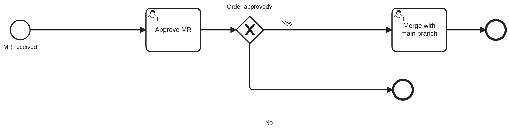

# Camunda Platform Process Application
A Process Application for [Camunda Platform](http://docs.camunda.org).

This project has been generated by the Maven archetype
[camunda-archetype-servlet-war-7.18.0](https://docs.camunda.org/manual/latest/user-guide/process-applications/maven-archetypes/).

## Show me the important parts!
[BPMN Process](src/main/resources/process.bpmn)

Agents and interactions:
- Someone creates process MR
- John whether accepts or rejects the MR
- Mary fills the form with the date of merge if the MR is accepted

### Run and Inspect with Tasklist and Cockpit
Once you deployed the application you can run it using
[Camunda Tasklist](http://docs.camunda.org/latest/guides/user-guide/#tasklist)
and inspect it using
[Camunda Cockpit](http://docs.camunda.org/latest/guides/user-guide/#cockpit).

## Environment Restrictions
Built and tested against Camunda Platform version 7.18.0.

## License
[Apache License, Version 2.0](http://www.apache.org/licenses/LICENSE-2.0).

<!-- Tweet
New @Camunda example: Camunda Platform Process Application - A Process Application for [Camunda Platform](http://docs.camunda.org). https://github.com/camunda-consulting/code/tree/master/snippets/fluxodev
-->
